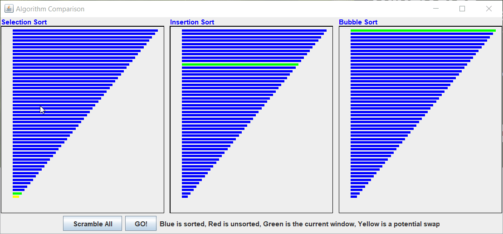

# nic-sorting-gui
Basic illustration of sorting using a simple Java GUI. 

# Installation

`git clone https://www.github.com/nsd4fr/nic-sorting-gui`

# Running

Either:
1. Navigate to src/
2. `javac *`
3. `java AlgoDisp`

Or:
1. Open AlgoDisp.java in Eclipse or some other editor
2. Compile and run from there

# Concepts Demonstrated
1. GUI and UI Design
2. Sorting
3. Inheritance
4. Callback-based events
5. Multi-threaded design

# Demo

